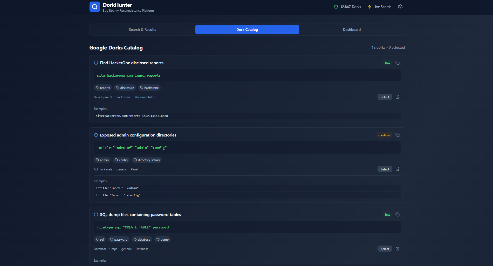

# DorkHunter

DorkHunter is a local React and TypeScript application for browsing, organizing, and experimenting with Google dork queries used during authorized bug bounty research.

> Use the queries only against assets you own or are explicitly authorized to test. DorkHunter does not bypass access controls or grant permission to inspect third-party systems.



## What is included

- **105 unique dorks** grouped into 22 category files.
- Queries for admin panels, exposed configuration, APIs, cloud storage, DevOps tools, WordPress, and other reconnaissance targets.
- Typed metadata for category, platform, asset type, noise level, tags, and examples.
- Saved-query and export flows for JSON, CSV, and Markdown.
- Automated catalog validation, unit tests, linting, and production builds.
- GitHub Actions quality gates for pushes and pull requests.

The current search-results screen uses deterministic demonstration data. It does **not** call Google or another live search API. The catalog itself contains the real queries and can be copied for authorized use.

## Requirements

- Node.js 22.12.0 or newer
- npm

## Quick start

```bash
git clone https://github.com/404xploit/DorkHunter.git
cd DorkHunter
npm ci
npm run dev
```

Vite prints the local URL when it starts; by default it is <http://localhost:5173>.

## Quality commands

| Command | Purpose |
| --- | --- |
| `npm run validate:dorks` | Validate every catalog file and reject malformed or duplicate records |
| `npm test` | Run the validator unit tests once |
| `npm run test:watch` | Run tests interactively during development |
| `npm run lint` | Run ESLint across the codebase |
| `npm run typecheck` | Run the TypeScript compiler without emitting files |
| `npm run build` | Type-check and build the production bundle |
| `npm run check` | Run all quality gates in CI order |

## Catalog structure

Catalog entries live in `src/data/dorks/`, with one JSON file per category:

```text
src/data/dorks/
├── admin-panels.json
├── api-endpoints.json
├── cloud-storage.json
├── config-files.json
└── ...
```

Each entry follows this shape:

```json
{
  "id": "184",
  "query": "inurl:\"/v3/api-docs\" OR inurl:\"/openapi.json\"",
  "description": "Exposed OpenAPI specification documents",
  "category": "api-endpoints",
  "platform": ["generic"],
  "assetType": "documentation",
  "noiseLevel": "low",
  "tags": ["openapi", "swagger", "api-docs"],
  "examples": ["inurl:\"/swagger.json\" filetype:json"]
}
```

The validator enforces:

- unique positive numeric IDs;
- IDs that fit safely in JavaScript's integer range;
- unique queries after case and whitespace normalization;
- required fields and supported enum values;
- category/file-name consistency;
- sorted IDs within each file;
- non-empty arrays without repeated values;
- balanced query/example quotes;
- lowercase URL-safe tags;
- a minimum catalog size of 100 entries.
- every supported category file present and non-empty.

Run `npm run validate:dorks` before submitting a catalog change.

## Continuous integration

The workflow in `.github/workflows/ci.yml` runs on every pull request and every push to `main`. It installs dependencies with `npm ci` and executes `npm run check`, covering validation, tests, ESLint, and the production build.

## Contributing

1. Add or update entries in the appropriate category JSON file.
2. Keep IDs sorted and do not reuse an existing ID.
3. Run `npm run check`.
4. Open a pull request describing the query source and intended authorized use.

Created by [404xploit](https://github.com/404xploit).
